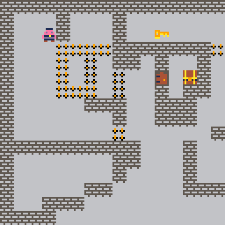
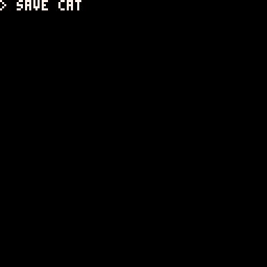
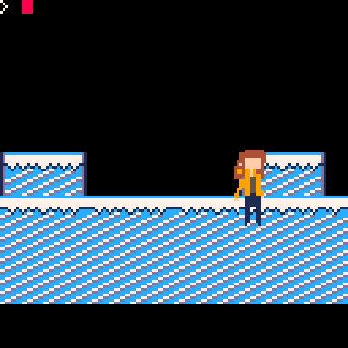
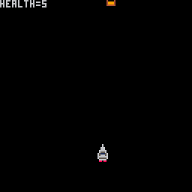
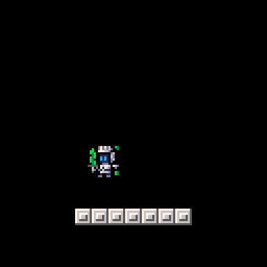
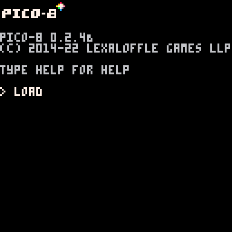
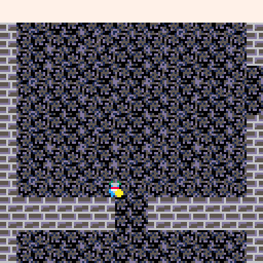
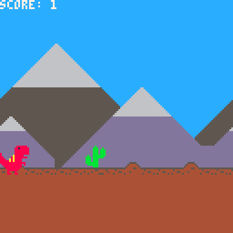

# 2022 - Spring
## [Game Portfolio for NMSU Digital Game Design](/../index.md)

Projects are organized by team. Each team has the animated gif of their logo, and a series of games below, each with a gif preview and links to versions of the game.

## Contents
- [-UWU-](#-uwu-)
- [CatCat](#catcat---catsm7-gabemauger)
- [Circus Bears](#circus-bears---mrbryantguy-johng148-alexismen22a-asellersx)
- [Pico Zen](#pico-zen)
- [PIxL Lab](#pixl-lab---z-toups)
- [Golden Wind](#Golden-Wind)
- [Project Team 12](#project-team-12)
- [Rogue One](#rogue-one---dalmei97-mgroov-kpbianco-luisrojas99)
- [Sky Bison](#sky-bison)
- [Super Retro Game Co](#super-retro-game-co---gearsie-river-rs-emmatianxy-mishavc)
- [TIM](#tim)

### -UWU- devinthaker, ddelac, hsando20, tiennhann, & nekMont 

[Prison Break](/2022-1/UWU/prisonbreak.html) \| [v0.1](https://github.com/ddelac/UWU/releases/tag/v0.1)

### CatCat - [catsm7](https://www.linkedin.com/in/catalina-sm/), [gabemauger](https://www.linkedin.com/in/gabriel-mauger-5210151a5/)

[Shooter](/catcat/shooter.html) \| [v0.2](https://github.com/gabemauger/catcat/releases/tag/v0.2)

### Circus Bears - mrbryantguy, johng148, alexismen22a, asellersX

[v0.5](https://github.com/mrbryantguy/School-Route-Charlie/releases/tag/v0.5)

### Pico Zen 
[boatGame](/pico-zen/newboat.html) \| [v0.5](https://github.com/angelinaplaza7/Pico-Zen/releases/tag/v0.5)

### PIxL Lab - [Z Toups](https://pixllab.github.io)

[PicoSweeper](/pixl-lab/picosweeperv1_0.html) \| [v1.0](https://github.com/toupsz/pico-8/releases/tag/v1.0)

[Samus Movement Demo](/pixl-lab/samusmovev0_3.html) \| (no versions yet)

[PIxL Pong!](/pixl-lab/pixlpong.html) \| [v0.8](https://github.com/NMSU-DGD/lets_make_in_pico_8/releases/tag/0.8)

(Animated GIF to come!)

### Golden Wind - Kaily Luna

[Artie’s Adventure](/GoldenWind/fpv1/artie’sadventure.html) \| [v0.1](https://github.com/KailyLuna/GoldenWind/releases/tag/v0.1)

### Project Team 12

### Rogue One - dalmei97, mgroov, kpbianco, LuisRojas99

[RougeOne](/RougeOne/rogueone_v0.71-2.html) \| [v0.71](https://github.com/dalmei97/RougeOne/releases/tag/v0.71)

### Sky Bison - alaynar, MeaganWaldo, tom9910

[Yip-yip](/Sky Bison/yipyip.html) \| [v0.5](https://github.com/alaynar/yip-yip/releases/tag/v0.5)

### Super Retro Game Co - Gearsie, River-RS, emmatianxy, mishavc
"Cyber Saver" | [v0.5](https://github.com/Gearsie/Super-Retro-Game-Co/releases/tag/v0.5)  

### TIM - Isaias66, MigglesHere, Theo-Platt

"TIM Logo" | [v0.7](https://github.com/MigglesHere/CS477-TIM/releases/tag/v0.7)

"Dashing Around"| [v0.5](https://github.com/MigglesHere/CS477-TIM/releases/tag/v0.5)

[Run Dino](/tim/lightning.html) \| [v0.8](https://github.com/MigglesHere/CS477-TIM/releases/tag/v0.8)