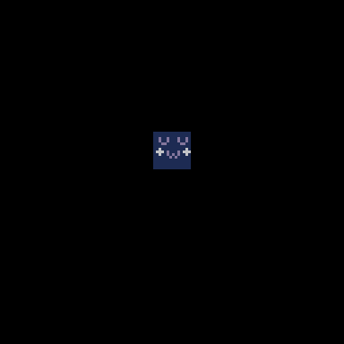
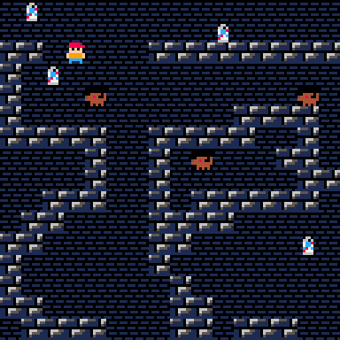
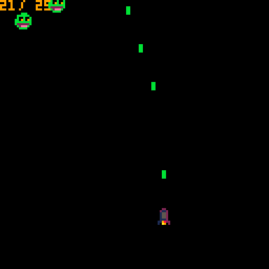
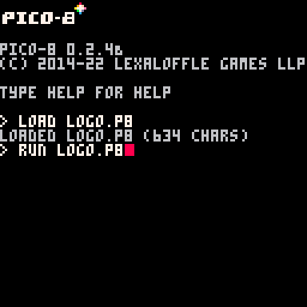
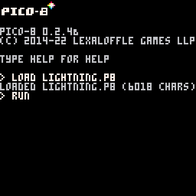
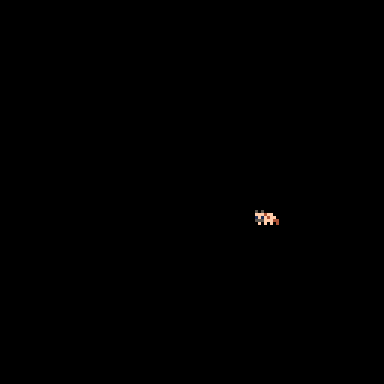
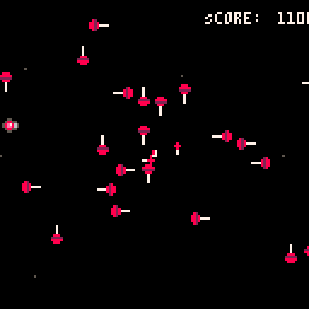

# 2022 - Spring
## [Game Portfolio for NMSU Digital Game Design](/../index.md)

Projects are organized by team. Each team has the animated gif of their logo, and a series of games below, each with a gif preview and links to versions of the game.

## Contents

- [-UWU-](#-UWU-)
- [CatCat](#CatCat---catsm7-gabemauger)
- [Circus Bears](#circus-bears---mrbryantguy-johng148-alexismen22a-asellersx)
- [Pico Zen](#pico-zen---angelinaplaza7-cpearce1-i-gerena-mariorod1015-stevendenny)
- [PIxL Lab](#pixl-lab---z-toups)
- [Golden Wind](#Golden-Wind)
- [Project Team 12](#project-team-12)
- [Rogue One](#rogue-one---dalmei97-mgroov-kpbianco-luisrojas99)
- [Sky Bison](#sky-bison)
- [Super Retro Game Co](#super-retro-game-co---gearsie-river-rs-emmatianxy-mishavc)
- [TIM](#tim)

### UWU devinthaker💀 , ddelac😬 , hsando20( ͡° ͜ʖ ͡°) , tiennhann😶 , & nekMont💅 

[Prison Break](/2022-1/UWU/prisonbreak.html) \| [v0.1](https://github.com/ddelac/UWU/releases/tag/v0.1)

[KegRush](./UWU/white_lightening.html) \| [v0.2](https://github.com/ddelac/UWU/releases/tag/v0.2)

### CatCat - [catsm7](https://www.linkedin.com/in/catalina-sm/), [gabemauger](https://www.linkedin.com/in/gabriel-mauger-5210151a5/)

[Shooter](/catcat/shooter.html) \| [v0.2](https://github.com/gabemauger/catcat/releases/tag/v0.2)

[Space Blaster Lightning Game](/catcat/spaceblaster.html) \| [v0.3](https://github.com/gabemauger/catcat/releases/tag/v0.3)

#### Space Blaster Pitch

##### We have developed a simple version of a Space Blaster with one enemy pattern; the furtherance of this version would have more levels with different enemy attack patterns and at least one different weight of shooting for the player. Catcat envisions this shooter game to invoke nostalgia for the game of Galaga that is widely accessible through the platform of Pico-8. Some current features of the game in the most recent release include win/lose states, different enemies, replay button, and movement boundaries. It is our hope that a newer generation will be able to enjoy this style of game

[Kepland Fv2](/catcat/dun_craw.html) \| [v0.4](https://github.com/gabemauger/catcat/releases/tag/v0.4)

### Circus Bears - mrbryantguy, johng148, alexismen22a, asellersX

[v0.5](./SchoolRouteCharlie/srch.html)

[Sanik Coins](./SchoolRouteCharlie/sanik.html)

### Pico Zen - angelinaplaza7, cpearce1, i-gerena, mariorod1015, stevendenny

[boatGame](/pico-zen/newboat.html) \| [v0.5](https://github.com/angelinaplaza7/Pico-Zen/releases/tag/v0.5)
[lighteningGame](/pico-zen/index.html)

### PIxL Lab - [Z Toups](https://pixllab.github.io)

[PicoSweeper](/pixl-lab/picosweeperv1_0.html) \| [v1.0](https://github.com/toupsz/pico-8/releases/tag/v1.0)

[Samus Movement Demo](/pixl-lab/samusmovev0_3.html) \| (no versions yet)

[PIxL Pong!](/pixl-lab/pixlpong.html) \| [v0.8](https://github.com/NMSU-DGD/lets_make_in_pico_8/releases/tag/0.8)

(Animated GIF to come!)

### Golden Wind - Kaily Luna

[Artie’s Adventure](/GoldenWind/fpv1/artie’sadventure.html) \| [v0.1](https://github.com/KailyLuna/GoldenWind/releases/tag/v0.1)

[Artie’s Adventure](/GoldenWing/fpv2\artie'sadventure.html) \| [v.03](https://github.com/KailyLuna/nmsu-dgd.github.io/releases/tag/v0.3)

[Artie’s Adventure - Final Demo](/GoldenWind/FinalDemo/artie’sadventure.html) \| [v1.0](https://github.com/KailyLuna/nmsu-dgd.github.io/releases/tag/v1.0)

### Project Team 12

### Rogue One - dalmei97, mgroov, kpbianco, LuisRojas99

[RogueOne](/RougeOne/rogueone_v0.71-2.html) \| [v0.71](https://github.com/dalmei97/RougeOne/releases/tag/v0.71)

[Rougelightning](/RougeOne/lightning.html) \| [v1.0]

### Sky Bison - alaynar, MeaganWaldo, tom9910

[Yip-yip](/Sky Bison/yipyip.html) \| [v0.6](https://github.com/alaynar/yip-yip/releases/tag/v0.6) \| [v0.5](https://github.com/alaynar/yip-yip/releases/tag/v0.5) \| [v0.9](https://github.com/alaynar/yip-yip/releases/tag/v0.9)

[Toy Catch](./Sky Bison/toy_catch.html) \| [v1.0](https://github.com/alaynar/yip-yip/releases/tag/v1.0-lightning)

### Super Retro Game Co - Gearsie, River-RS, emmatianxy, mishavc
"Cyber Saver" | [v0.5](https://github.com/Gearsie/Super-Retro-Game-Co/releases/tag/v0.5)  

Super Retro Game Co logo screen | [v0.6](https://github.com/Gearsie/Super-Retro-Game-Co/releases/tag/v0.6)

[Lollipocalypse](./Super-Retro-Game-Co/lollipocalypse.html) \| [v0.7](https://github.com/Gearsie/Super-Retro-Game-Co/releases/tag/v0.7)

### TIM - Isaias66, MigglesHere, Theo-Platt

"TIM Logo" | [v0.7](https://github.com/MigglesHere/CS477-TIM/releases/tag/v0.7)

[Dashing Around](/tim/tim.html) \| [v0.5](https://github.com/MigglesHere/CS477-TIM/releases/tag/v0.5)

[Run Dino](/tim/lightning.html) \| [v0.8](https://github.com/MigglesHere/CS477-TIM/releases/tag/v0.8)
