# 2022 - Fall

## [Game Portfolio for NMSU Digital Game Design](/../index.md)

Projects are organized by team. Each team has the animated gif of their logo, and a series of games below, each with a gif preview and links to versions of the game.

## Contents

- [Alis](#alis---laszlo-nguyen)
- [Ascension](#ascension)
- [Beat](#dustin-bachman--navarre-brown--marcus-martinez--steven-williams)
- [Bullet Blaze](#bullet-blaze)
- [Brick Breaker](#brick-breaker)
- [Bullet Blaze](#bullet-blaze---steven-williams)
- [Chicken Shooter](#chicken-shooter--william-le--alejandro-flores--matthew-groover--morgan-knight--ruidong-chen--)
- [Concerned Ape](#concerned-ape---vinny-mikelic)
- [Fat Bird](#fat-bird)
- [Galactic Survival](#galactic-survival--alejandro-flores--fabliha-bushra)
- [Gunner Channel](#gunner-channel)
- [Insufficient A](#insufficient-a---a-marquez)
- [Lotus](#lotus)
- [Maze in the Dungeon](#Maze-in-the-Dungeon)
- [Miny](#miny---dustinbachman)
- [One's Comp Games](#ones-comp-games--m-romero)
- [PIxL Lab](#pixl-lab---phoebe-toups-dugas)
- [Polar Pear](#polar-pear)
- [Radical Ascension](#radical-ascension---dylrlas)
- [Rat-Man](#rat-man---andrew-melo)
- [Sumptuous Skunk](#sumptuous-skunk---simon-hockin)
- [Team Lamb](#team-lamb---r-vargas)
- [The Dropouts](#the-dropouts)
- [The Iron Squids](#the-iron-squids--j-cooper--d-ferguson)
- [Tony Spicy](#TonySpicy)
- [Rand 3](#rand-3---ryan-john-weems-simon-hockin)
- [Space Invaders: Phys](#space-invaders---phys)

### Alis - [Laszlo Nguyen](https://github.com/LaszloNguyen)

### Ascension - navarrebrown

[Ascension](/Ascension/protoype1/ascension.p8.html)\| [v0.1](https://github.com/navarrebrown/cs477/releases/tag/v0.1)

### Beat - [Dustin Bachman, Navarre Brown, Marcus Martinez, Steven Williams](https://github.com/marcusm5670/LightningGame)

[Play](Beat/beatv0.2.html) \| [Release page](https://github.com/marcusm5670/LightningGame/releases/tag/v0.2)

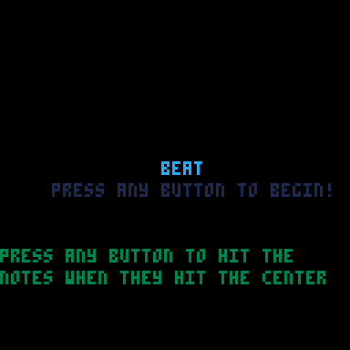

[Brick Breaker](./brickbreak/brickbreak.html) - [John Gilbert, Dylan Lassard, Elias Leverett, Levi Lopez](https://github.com/llopez020/Lightning-Game)

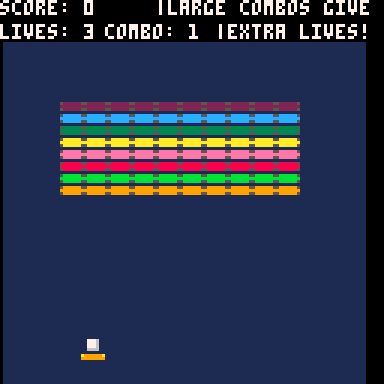

### Bullet Blaze - [Steven Williams](https://github.com/swillNMSU)

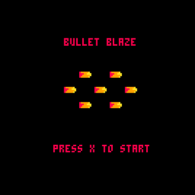

[Bullet Blaze Web Demo](/BulletBlaze/bulletblaze.html) \| [v0.1](https://github.com/swillNMSU/BulletBlaze/releases/tag/v0.1)

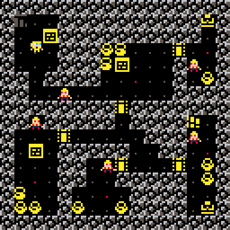

### Chicken Shooter - [William Le](https://github.com/thinhtun2000), [Alejandro Flores](https://github.com/ilbambino4), [Matthew Groover](https://github.com/mgroov), [Morgan Knight](https://github.com/mknight132), [Ruidong Chen](https://github.com/chenruid)

[Chicken Shooter](/ChickenShooter/chicken.html) \| (V1.0)

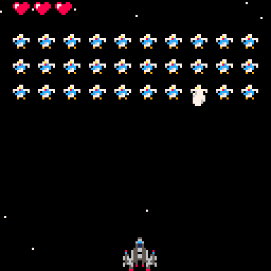

### Concerned Ape - [Vinny Mikelic](https://github.com/vmikelic)

[hop](https://vmikelic.github.io/hop) \| [v0.1](https://github.com/vmikelic/hop-PICO8/releases/tag/v0.1)

### Fat Bird - [marcusm5670](https://github.com/marcusm5670/CS477-GameRepo)

Subgame - [Play](2022-3/FatBird/v0.15/subgame.html) | [Release page v0.15](https://github.com/marcusm5670/CS477-GameRepo/releases/tag/v0.15)

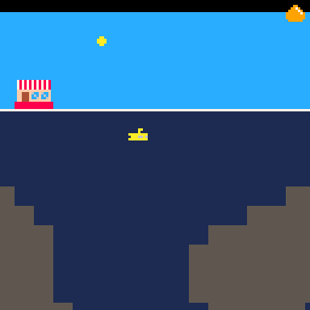

### Galactic Survivor - [Alejandro Flores](https://github.com/ilbambino4), [Fabliha Bushra](https://github.com/fbushra)

[Galactic Survival](/Galactic-Survival/galactic.html) \| (no versions yet)

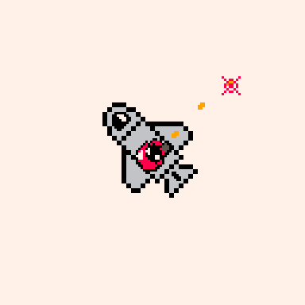

### Gunner Channel - Mgroov

https://mgroov.github.io/starstruck/

### Insufficient A - [A. Marquez](https://github.com/amarq30) 
[The Help v0.1](/InsufficientA/thehelp.html)

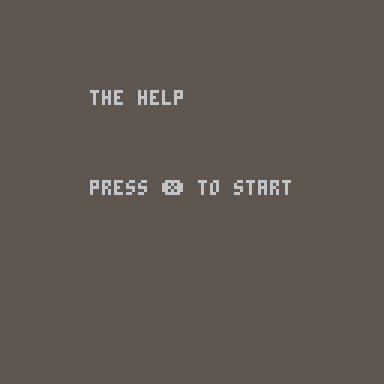

[Lotus](./lotus/lotus.html) - [Levi Lopez](https://github.com/llopez020)

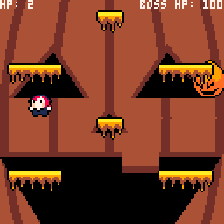

### Maze in the Dungeon - Ruidong Chen, Morgan Knight, Xiaoyan Tian

[Click to play demo](/Maze-in-Dungeon/maze.html) \| [v0.1](https://github.com/chenruid/Pico-8-Maze---477-/releases/tag/v0.1)

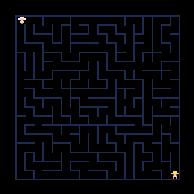

### Miny - [dustinbachman](https://github.com/dustinbachman/PICOProject)

[Miny](/Miny/minyv1.html) \| [v0.10](https://github.com/dustinbachman/PICOProject/releases/tag/v0.10)

### One's Comp Games - [M. Romero](https://github.com/matrom01-v2)

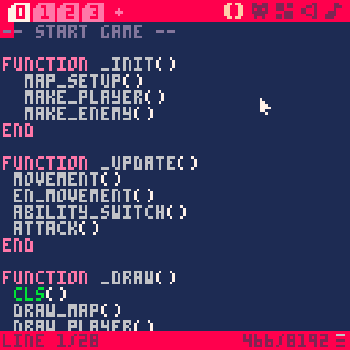

[Sinister Steel](/sin-steel/sinsteel.html) \| [v1.0](https://github.com/matrom01-v2/Pico-8Site/releases/tag/v1.0)
### PIxL Lab - [Phoebe Toups Dugas](https://pixllab.github.io)

[PicoSweeper](/pixl-lab/picosweeperv1_0.html) \| [v1.0](https://github.com/snapdragoness/pico-8/releases/tag/v1.0)

[Samus Movement Demo](/pixl-lab/samusmove.html) \| (no versions yet)

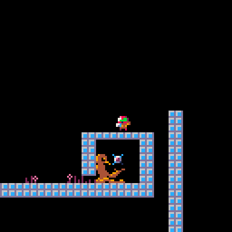

[PIxL Pong!](/pixl-lab/pixlpong.html) \| [v0.8](https://github.com/NMSU-DGD/lets_make_in_pico_8/releases/tag/0.8)

### Polar Pear - [William Le]()

[NinJump](/2022-3/Polar-Pear/pjj.html) \| [v0.1](https://github.com/thinhtun2000/Ninjump/releases/tag/v0.1)

### Radical Ascension - [Dylan L.] (https://github.com/dylrlas/Team-Repo)

[BattleofChaos](https://dylrlas.github.io/Team-Repo/battleofchaos.html) \| [v0.1](https://github.com/dylrlas/Team-Repo/releases/tag/v0.1)

### Rat-Man - [Andrew Melo]
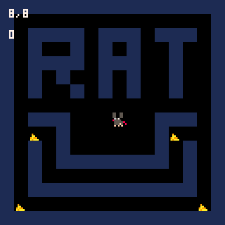

[Rat-Man](/Rat-Man/ratman.html) \| [v0.1](https://github.com/andrewmelo32/Rat-Man/releases/tag/v0.1)

### Sumptuous Skunk - [Simon Hockin](https://github.com/Kira-Flakes)

Skarper - [Play](/2022-3/SumptuousSkunk/skarper.html) | [Release v.0.1](https://github.com/Kira-Flakes/CS-477-Game/releases/tag/v0.1)

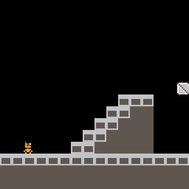

### Team Lamb - [R. Vargas](https://github.com/robertvargas-irq)

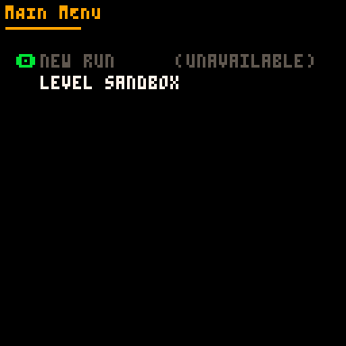

[Apocalypse Couriers](./TheLamb/apocalypse_couriers.html) \| [v0.1](https://github.com/robertvargas-irq/gamedev-pico8-game-source/releases/tag/v0.1)

### The Dropouts

### The Iron Squids - [J. Cooper](https://github.com/n0dat) [D. Ferguson](https://github.com/InlaidData)

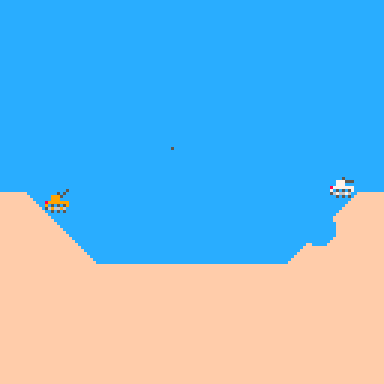

[Armored War Assault II Lite](/armored-war-assault-II-lite/tanks.html) \| [v0.1](https://github.com/n0dat/armored-war-assault-II-lite/releases/tag/v0.1)

### Tony Spicy - [John Gilbert](https://github.com/JohnMGilbert)

[SuperMetalDetector](/TonySpicy/supermetal.html) \| [v1.1](https://github.com/JohnMGilbert/MetalDetectorGame/releases/tag/v0.1) 

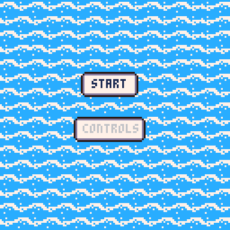

### BLAST BROS - [Andres Marquez James Cooper Andrew Melo Mateo Romero](https://github.com/matrom01-v2/LightningGame)

<image src="./logos/escapedetroit_2.gif" alt="Demonstration of our sick new lightning game" width="128" />

[Escape Detroit](/escape-detroit/escapedetroit.html) \| [v1.0](https://github.com/matrom01-v2/LightningGame/releases/tag/v1.0)

### Rand 3 - Ryan (John) Weems, Simon Hockin 

Maze Guy (Lightning Game) - [Play](/2022-3/Maze-Guy/mazeguy.html) | [Release v.0.1.1](https://github.com/Kira-Flakes/CS-477-Game/releases/tag/v0.1.1)

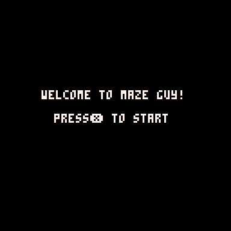

### Space Invaders - Phys

[Space Invaders: Phys](https://vmikelic.github.io/lightning) \| [v1.0](https://github.com/vmikelic/lightning-game-rand/releases/tag/v1.0)

