# 2022 - Fall

## [Game Portfolio for NMSU Digital Game Design](/../index.md)

Projects are organized by team. Each team has the animated gif of their logo, and a series of games below, each with a gif preview and links to versions of the game.

## Contents

- [2022 - Fall](#2022---fall)
  - [Game Portfolio for NMSU Digital Game Design](#game-portfolio-for-nmsu-digital-game-design)
  - [Contents](#contents)
    - [Alis - Laszlo Nguyen](#alis---laszlo-nguyen)
    - [Ascension - Navarre Brown](#ascension---navarre-brown)
    - [Beat - Dustin Bachman, Navarre Brown, Marcus Martinez, Steven Williams](#beat---dustin-bachman-navarre-brown-marcus-martinez-steven-williams)
    - [BLAST BROS - Andres Marquez James Cooper Andrew Melo Mateo Romero](#blast-bros---andres-marquez-james-cooper-andrew-melo-mateo-romero)
    - [Bullet Blaze - Steven Williams](#bullet-blaze---steven-williams)
    - [Cave Ascent - Elias Leverett (https://eliaslev0.github.io/Fall-2022-Game-Design/caveascent.html)](#cave-ascent---elias-leverett-httpseliaslev0githubiofall-2022-game-designcaveascenthtml)
    - [Chicken Shooter - William Le, Alejandro Flores, Matthew Groover, Morgan Knight, Ruidong Chen](#chicken-shooter---william-le-alejandro-flores-matthew-groover-morgan-knight-ruidong-chen)
    - [Concerned Ape - Vinny Mikelic](#concerned-ape---vinny-mikelic)
    - [Fat Bird - marcusm5670](#fat-bird---marcusm5670)
    - [Galactic Survival - Alejandro Flores, Fabliha Bushra](#galactic-survival---alejandro-flores-fabliha-bushra)
    - [Gunner Channel - Mgroov](#gunner-channel---mgroov)
    - [Insufficient A - A. Marquez](#insufficient-a---a-marquez)
    - [Maze in the Dungeon - Ruidong Chen, Morgan Knight, Xiaoyan Tian](#maze-in-the-dungeon---ruidong-chen-morgan-knight-xiaoyan-tian)
    - [Miny - dustinbachman](#miny---dustinbachman)
    - [Ones Comp Games - Mateo Romero](#ones-comp-games---mateo-romero)
    - [PIxL Lab - Phoebe Toups Dugas](#pixl-lab---phoebe-toups-dugas)
    - [Polar Pear - William Le](#polar-pear---william-le)
    - [Radical Ascension - Dylan L.](#radical-ascension---dylan-l)
    - [Rand 3 - Ryan (John) Weems, Simon Hockin](#rand-3---ryan-john-weems-simon-hockin)
    - [Rat-Man - Andrew Melo](#rat-man---andrew-melo)
    - [Snake - Michael Medrano](#snake---michael-medrano)
    - [Space Invaders - Phys](#space-invaders---phys)
    - [Sumptuous Skunk - Simon Hockin](#sumptuous-skunk---simon-hockin)
    - [Team Lamb - Em (R.) Vargas](#team-lamb---em-r-vargas)
    - [The Dropouts](#the-dropouts)
    - [The Iron Squids - J. Cooper D. Ferguson](#the-iron-squids---j-cooper-d-ferguson)
    - [Tony Spicy - John Gilbert](#tony-spicy---john-gilbert)

### Alis - [Laszlo Nguyen](https://github.com/LaszloNguyen)

### Ascension - [Navarre Brown](https://github.com/navarrebrown/cs477)

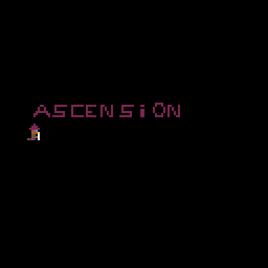

[Ascension](/Ascension/final_game/ascension.p8.html) \| [v1.0](https://github.com/navarrebrown/cs477/releases/tag/v1.0) \| [v0.2](https://github.com/navarrebrown/cs477/releases/tag/v0.2)

<!-- 

 -->

### Beat - [Dustin Bachman, Navarre Brown, Marcus Martinez, Steven Williams](https://github.com/marcusm5670/LightningGame)

[Play](Beat/beatv0.2.html) \| [Release page](https://github.com/marcusm5670/LightningGame/releases/tag/v0.2)

### BLAST BROS - [Andres Marquez James Cooper Andrew Melo Mateo Romero](https://github.com/matrom01-v2/LightningGame)

<image src="./logos/escapedetroit_2.gif" alt="Demonstration of our sick new lightning game" width="128" />

[Escape Detroit](/escape-detroit/escapedetroit.html) \| [v1.0](https://github.com/matrom01-v2/LightningGame/releases/tag/v1.0)

[Brick Breaker](./brickbreak/brickbreak.html) - [John Gilbert, Dylan Lassard, Elias Leverett, Levi Lopez](https://github.com/llopez020/Lightning-Game)

### Bullet Blaze - [Steven Williams](https://github.com/swillNMSU)

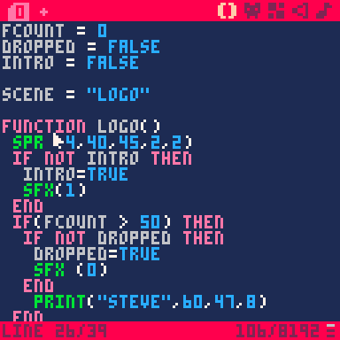

[Bullet Blaze Web Demo](/BulletBlaze/bulletblaze.html) \| [v0.1](https://github.com/swillNMSU/BulletBlaze/releases/tag/v0.1)

### Cave Ascent - Elias Leverett (https://eliaslev0.github.io/Fall-2022-Game-Design/caveascent.html)

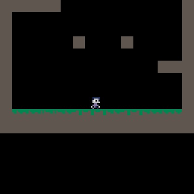

### Chicken Shooter - [William Le](https://github.com/thinhtun2000), [Alejandro Flores](https://github.com/ilbambino4), [Matthew Groover](https://github.com/mgroov), [Morgan Knight](https://github.com/mknight132), [Ruidong Chen](https://github.com/chenruid)

[Chicken Shooter](/ChickenShooter/chicken.html) \| (V1.0)

### Concerned Ape - [Vinny Mikelic](https://github.com/vmikelic)

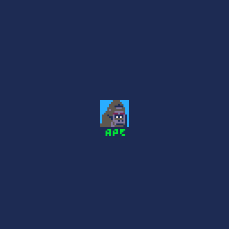

[hop](https://vmikelic.github.io/hop) \| [v1.0](https://github.com/vmikelic/hop-PICO8/releases/tag/v1.0)

### Fat Bird - [marcusm5670](https://github.com/marcusm5670/CS477-GameRepo)

Saltwater - [Play](/FatBird/saltwater.html) | [Release page v0.8](https://github.com/marcusm5670/CS477-GameRepo/releases/tag/v0.8)

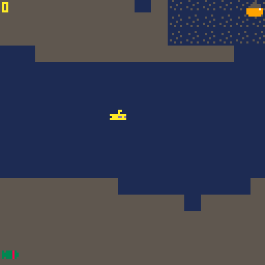

### Galactic Survival - [Alejandro Flores](https://github.com/ilbambino4), [Fabliha Bushra](https://github.com/fbushra)
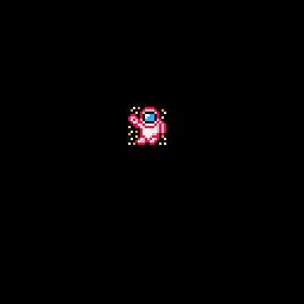

[Galactic Survival](/Galactic-Survival/galactic_survival.html) \| [v0.1](https://github.com/ilbambino4/CS477-PGP/releases/tag/V0.1), [v0.3](https://github.com/ilbambino4/CS477-PGP/releases/tag/V0.3), [v1.0](https://github.com/ilbambino4/CS477-PGP/releases/tag/V1.0)

[Airborn Survival](/Galactic-Survival/airborn_survival.html) \| [v0.1](https://github.com/ilbambino4/CS477-PGP/releases/tag/V0.1), [v0.3](https://github.com/ilbambino4/CS477-PGP/releases/tag/V0.3), [v1.0](https://github.com/ilbambino4/CS477-PGP/releases/tag/V1.0)

### Gunner Channel - Mgroov

https://mgroov.github.io/starstruck/

### Insufficient A - [A. Marquez](https://github.com/amarq30)

[The Help v0.3](/InsufficientA/thehelpv2.html)

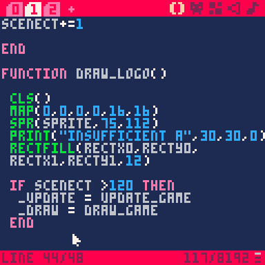

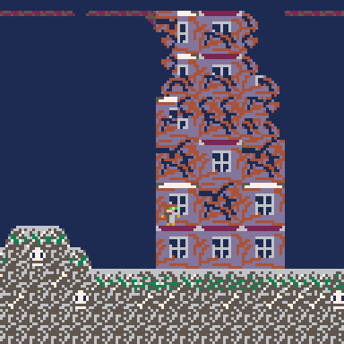

[Lotus](./lotus/lotus.html) - [Levi Lopez](https://github.com/llopez020)

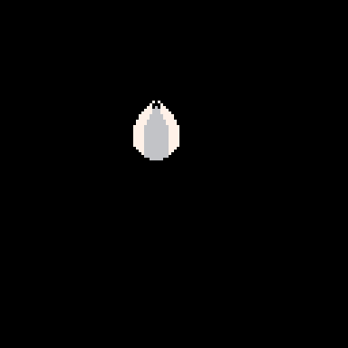

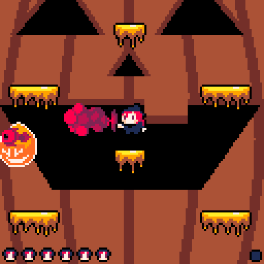

### Maze in the Dungeon - Ruidong Chen, Morgan Knight, Xiaoyan Tian

[Click to play demo](/Maze-in-Dungeon/maze.html) \| [v1.0](https://github.com/chenruid/Pico-8-Maze---477-/releases/tag/v1.0)

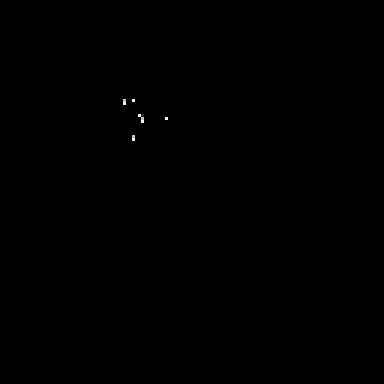

### Miny - [dustinbachman](https://github.com/dustinbachman/PICOProject)

[Miny](/Miny/miny.html) \| [v0.7](https://github.com/dustinbachman/PICOProject/releases/tag/v0.7)

### Ones Comp Games - [Mateo Romero](https://github.com/matrom01-v2)

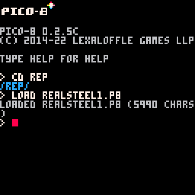

[Sinister Steel](/sin-steel/realsteel1.html) \| [v0.3](https://github.com/matrom01-v2/Pico-8Site/releases/tag/v0.3)

### PIxL Lab - [Phoebe Toups Dugas](https://pixllab.github.io)

[PicoSweeper](/pixl-lab/picosweeperv1_0.html) \| [v1.0](https://github.com/snapdragoness/pico-8/releases/tag/v1.0)

[Samus Movement Demo](/pixl-lab/samusmove.html) \| (no versions yet)

[PIxL Pong!](/pixl-lab/pixlpong.html) \| [v0.8](https://github.com/NMSU-DGD/lets_make_in_pico_8/releases/tag/0.8)

### Polar Pear - [William Le]()

[NinJump](/2022-3/Polar-Pear/final.html) \| [v1.0](https://github.com/thinhtun2000/Ninjump/releases/tag/v1.0)

### Radical Ascension - [Dylan L.](https://github.com/dylrlas/Team-Repo)

[BattleofChaos](https://dylrlas.github.io/Team-Repo/battleofchaosv1.0.html) \| [v1.0](https://github.com/dylrlas/Team-Repo/releases/tag/v1.0)

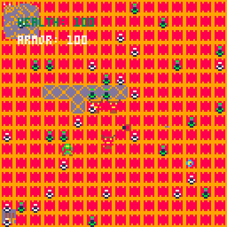

### Rand 3 - Ryan (John) Weems, Simon Hockin

Maze Guy (Lightning Game) - [Play](/2022-3/Maze-Guy/mazeguy.html) | [Release v.0.1.1](https://github.com/Kira-Flakes/CS-477-Game/releases/tag/v0.1.1)

### Rat-Man - Andrew Melo

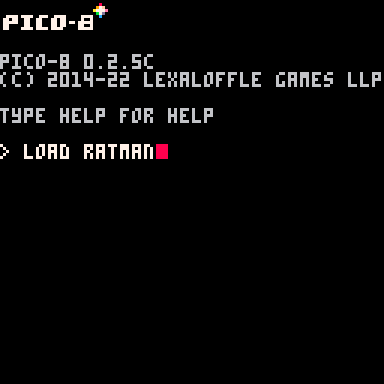

[Rat-Man](/Rat-Man/ratman.html) \| [v0.2](https://github.com/andrewmelo32/Rat-Man/releases/tag/v0.2)

### Snake - Michael Medrano

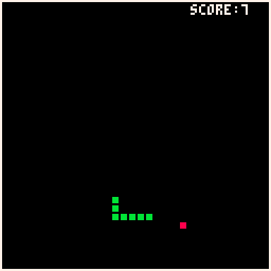

[Snake](./mysnake/mysnake.html)

### Space Invaders - Phys

[Space Invaders: Phys](https://vmikelic.github.io/lightning) \| [v1.0](https://github.com/vmikelic/lightning-game-rand/releases/tag/v1.0)

### Sumptuous Skunk - [Simon Hockin](https://github.com/Kira-Flakes)

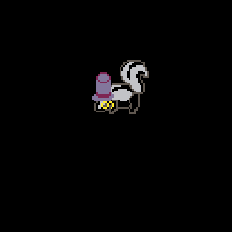

Skarper - [Play](/2022-3/SumptuousSkunk/skarper.html) | [Release v0.5](https://github.com/Kira-Flakes/CS-477-Game/releases/tag/v0.5)

### Team Lamb - [Em (R.) Vargas](https://github.com/robertvargas-irq)

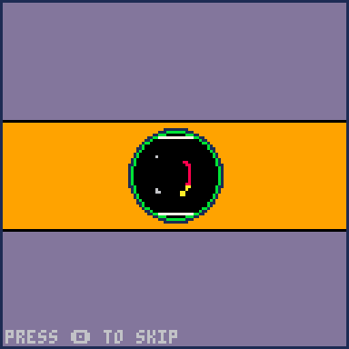

    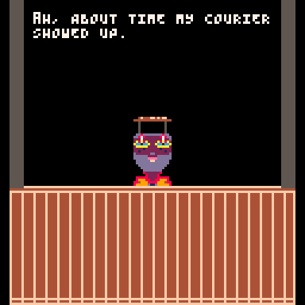
    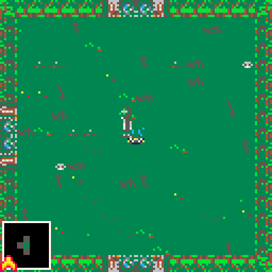
    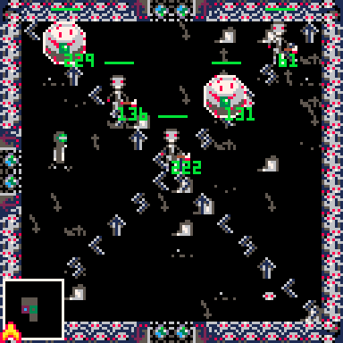
    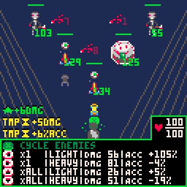
    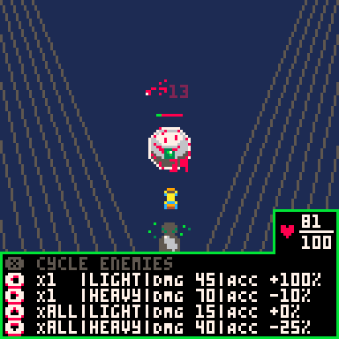

[Apocalypse Couriers](./TheLamb/ac_v_1_0.html) \| [v1.0](https://github.com/robertvargas-irq/gamedev-pico8-game-source/releases/tag/v1.0) \| [v0.2](https://github.com/robertvargas-irq/gamedev-pico8-game-source/releases/tag/v0.2) \| [v0.1](https://github.com/robertvargas-irq/gamedev-pico8-game-source/releases/tag/v0.1)

### The Dropouts

### The Iron Squids - [J. Cooper](https://github.com/n0dat) [D. Ferguson](https://github.com/InlaidData)

[Armored War Assault II Lite](/armored-war-assault-II-lite/tanks.html) \| [v0.4](https://github.com/n0dat/armored-war-assault-II-lite/releases/tag/v0.4)

### Tony Spicy - [John Gilbert](https://github.com/JohnMGilbert)

[SuperMetalDetector](/TonySpicy/supermetal.html) \| [v1.2](https://github.com/JohnMGilbert/MetalDetectorGame/releases/tag/v0.1)

