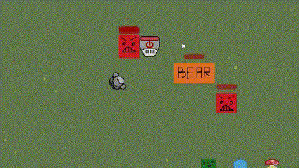
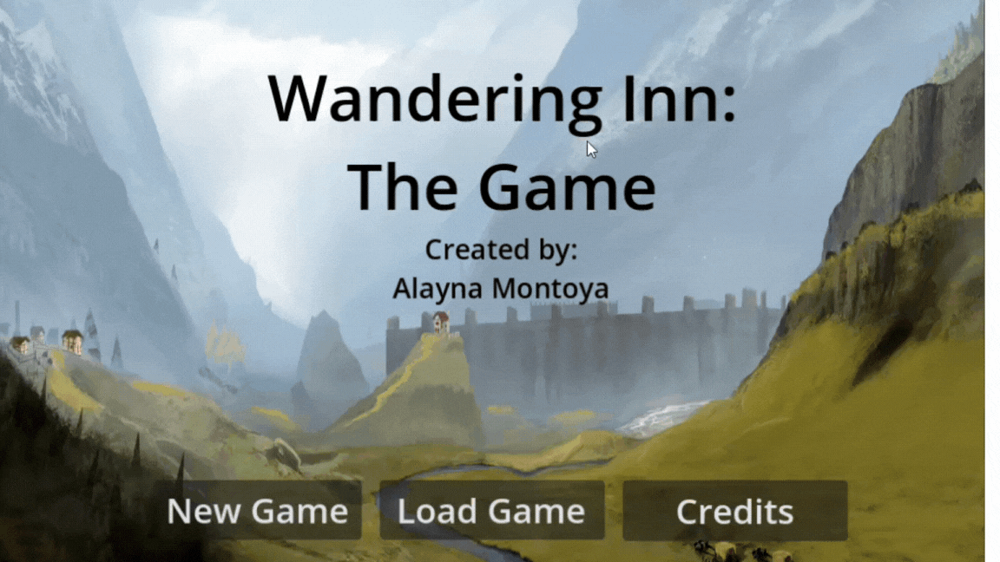
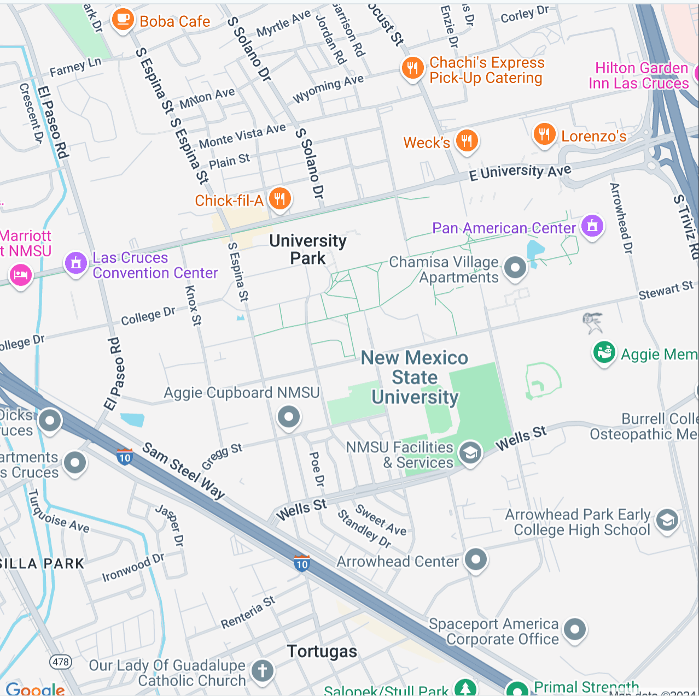
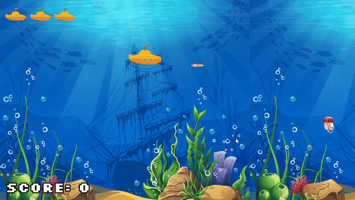
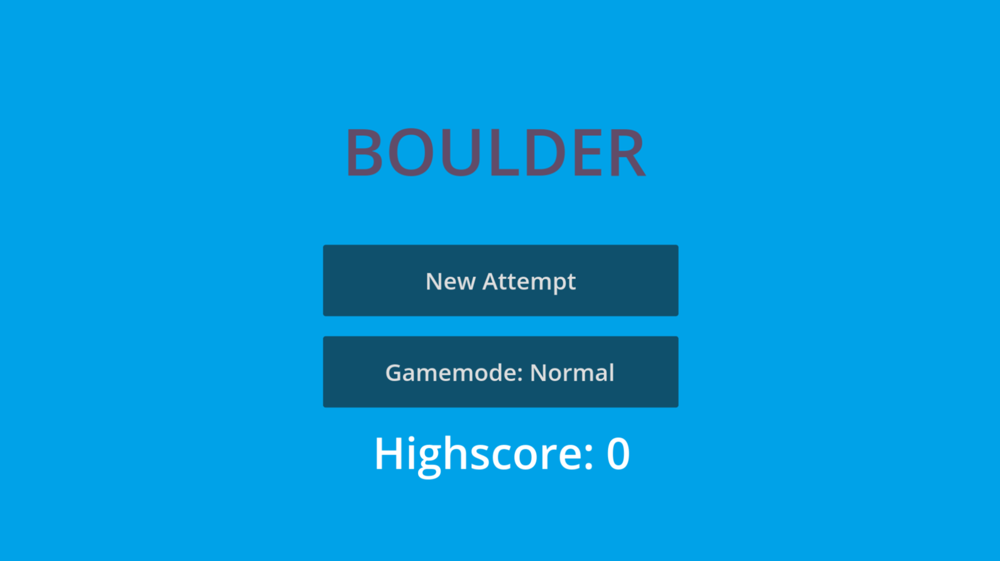
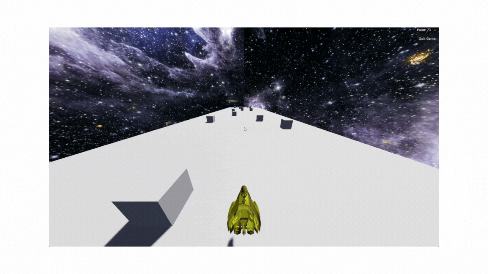
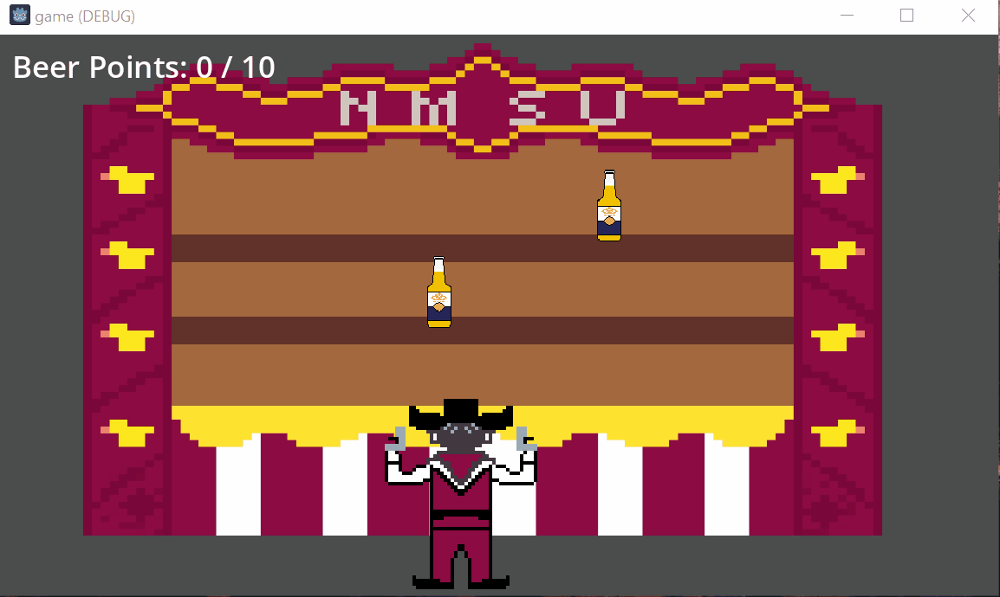
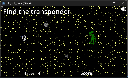

# 2024 - Fall

## [Game Portfolio for NMSU Digital Game Design](/../index.md)

Projects are organized by team. Each team has the animated gif of their logo, and a series of games below, each with a gif preview and links to versions of the game.

## Contents

### Team Games
- [Anointed](#anointed---dominik-trujillo-dtru5)
- [Bingo](#Bingo---FuadAhmad-shafiqaust)
- [Bloody Unicorn](#bloody-unicorn---karina-gonzaleskbg2201-david-davidkuntz02-ryan-rweems3-avery-gremloid)
- [BOOM!](#boom---christopher-biekeu-indronil-bhattacharjee-mingfang-zhu-redwan-ul-haq-choyon-sarhan-osman-bhuiya)
- [CodeCrashers](#Team-CodeCrashers----Akanksha4varma-Jaya-Jwalitha-Nagulla-meghana-20-Rama-Chandra-Baddireddy)
- [GAME CHANGERS](#GAME-CHANGERS---Fayaz-Shaik-Jyothiswaroop-Koyya-Mahesh-Maddineni-Vivekananda-Reddy-Pyda-Vivek-Reddy-Suram)
- [Neon Dream-On Joyride !!MISSING!!](#)
- [Roomate Studios](#Roomate-Studios---Matthew-Melendez-Rogelio-Long)
- [Rust Rescue !!MISSING!!](#)
- [Space Marshall](#Space-Marshall---chiagozie-Emelife-Julio-Estrada-Kwabena-Adu-Agyemang-Mauricio-Munoz-Sayantan-Maity)
- [*Totally NOT Adderall Abusers*](#totally-not-adderall-abusers---alex-paque-garns-jd-lepinski-matthew-quinones)
- [Wake Up !!MISSING!!](#)
- [Wandering Inn: The Game](#wandering-inn-the-game---alayna-montoya)
- [Zombie Bash](#zombie-bash---arentschool-gturner9371213-hakka2424-robrob7)

### Lightning Games
- [Group 0: Stalward Defenders](#team-ro---rogelio-long)
- [Group 1: One-Man Point-Man Space Combat](#lightning-game-team-1---indronil-bhattacharjee-sayantan-maity-fuad-ahmed-mingfang-zhu-joshua-wilson)
- [Group 2: NMSU Carnival Shooting](#lighting-game----alex-paque-garns-fayaz-shaik-sarhan-osman-bhuiya-xindi-z-)
- [Group 3: Bob the Builder](#group3----chiagozie-emelife-matthew-melendez-meghana-20-vivek-reddy-suram)
- [Group 4: Beyond Infinity](#beyond-infinity---redwan1795-ahmedbony-shiva1-d-alaynar)
- [Group 5: Bat's Midnight Dash](#group-5---karina-gonzaleskbg2201-rama-chandra-baddireddy-tyreke-hetzel-vivekananda-reddy-pyda)
- [Group 6: One-Lostronaut Space Shooting](#lightning-game-team-6---md-zaman-jyothiswaroop-koyya-david-kuntz-mauriciomunoz)
- [Group 7: Infinity-Lighting Game](#group-7---akanksha-varma-sagi--matthew-quinones-avery-johnson-garrett-turner)
- [Group 8: Boulder](#group-8---aren-trombley-kwabena-adu-agyemang-mahesh-maddineni-robert-armendariz)
- [Group 9: Lightning Game](#lightning-game---group-9---jaya-jwalitha-nagulla-jd-lepinski-john-weems-dominik-trujillo)
- [Group 10:<missing>](#)

## Team Game

### Team CodeCrashers -  Akanksha4varma, Jaya Jwalitha Nagulla, meghana-20, Rama Chandra Baddireddy
[School for Good and Evil](https://meghana-20.github.io/CodeCrashers/)

[v0.1](https://github.com/meghana-20/CodeCrashers/releases/tag/v0.1)
[v0.2](https://github.com/meghana-20/CodeCrashers/releases/tag/v0.2)

### GAME CHANGERS - Fayaz Shaik, Jyothiswaroop Koyya, Mahesh Maddineni, Vivekananda Reddy Pyda, Vivek Reddy Suram
[Uphill Adventure](https://vivekpyda.github.io/)

### *Totally NOT Adderall Abusers* - [Alex Paque Garns, JD Lepinski, Matthew Quinones]

### Bloody Unicorn - Karina Gonzales(kbg2201), David (Davidkuntz02), Ryan (rweems3), Avery (gremloid)

[Bloody Unicorn Demo](https://kbg2201.github.io/BUD-Team/demo/)

[v0.1](https://github.com/kbg2201/BUD-Team/releases/tag/v0.1)

### Roomate Studios - Matthew Melendez, Rogelio Long

[Escape Velocity](https://requestforcriticism.com/escape-velocity/)

[v0.1](https://github.com/requestforcriticism/escape-velocity/releases/tag/v0.1)

[v0.2](https://github.com/requestforcriticism/escape-velocity/releases/tag/v0.2)

### Space Marshall - chiagozie Emelife, Julio Estrada, Kwabena Adu Agyemang, Mauricio Munoz, Sayantan Maity
[Space Marshall](https://morimnz.github.io/spacemarshall/webgame)

[v0.1](https://github.com/MoriMnz/spacemarshall/releases/tag/v0.1)

### Zombie Bash - [arentschool, gturner9371213, Hakka2424, RobRob7]
[Zombie Bash](https://robrob7.github.io/Team-Zombie-Bash/WebGame/index.html)

[v0.1](https://github.com/RobRob7/Team-Zombie-Bash/releases/tag/v0.1)

### Bingo - FuadAhmad, shafiqaust

### BOOM! - Christopher Biekeu, Indronil Bhattacharjee, Mingfang Zhu, Redwan Ul Haq Choyon, Sarhan Osman Bhuiya
[BOOM!] We cannot host the game in github.io site because of the .pck file being larger than 100MB github limit. We will show the game functioning in the class.

[v0.1](https://github.com/Indronil-Prince/BOOM-Digital-Game-Design-Project/releases/tag/v1.0)
[v0.2](https://github.com/Indronil-Prince/BOOM-Digital-Game-Design-Project/releases/tag/v2.0)

### Wandering Inn: The Game - Alayna Montoya
[Wandering Inn](https://alaynar.github.io/wanderingInnGame/wig/index.html)

[v0.1](https://github.com/alaynar/wanderingInnGame/releases/tag/v0.1)

[v0.2](https://github.com/alaynar/wanderingInnGame/releases/tag/v0.2)

### Anointed - Dominik Trujillo (dtru5)
[Anointed](https://dtru5.github.io/anointedv0.2/)

[v0.2](https://github.com/dtru5/cs477-project_game/releases/tag/v0.2)

" alt="Movement and scene changing" height="128"/>

### Team TA - Theo Platt
[Shotgun Witch](./TAs_example/FPv1/shotgun_witch_FP1.html) 

[v0.1](https://github.com/Theo-Platt/Shotgun_Witch/releases/tag/v0.0.1) 

[v0.2](https://github.com/Theo-Platt/Shotgun_Witch/releases/tag/v0.0.2)

### Rust-Rescue - [ahmedbony, xindi-z]

[Rust-Rescue](https://xindi-z.github.io/Rust-Rescue/index.html)

[v0.1](https://github.com/xindi-z/Rust-Rescue/releases/tag/v0.1)

[v0.5](https://github.com/xindi-z/Rust-Rescue/releases/tag/v0.5)

## Lightning Game

### Lightning Game Team 1 - Indronil Bhattacharjee, Sayantan Maity, Fuad Ahmed, Mingfang Zhu, Joshua Wilson

[One-Man Point-Man Space Combat](https://indronil-prince.github.io/lightgame.html)

**Pitch:** In our 2D arcade survival game, players are plunged into a fast-paced, visually unique universe where they must survive waves of alien ships, each wave more challenging than the last. With captivating, one-of-a-kind artwork that brings the game's world to life, players will need sharp reflexes and strategy to dodge attacks and rack up scores by taking down as many alien ships as possible. This game is all about balancing risk and reward as players push their limits to survive and achieve high scores, making it an exciting test of skill and endurance.

[v0.1](https://github.com/Indronil-Prince/Lightning-Game-Creep/releases/tag/v1.0)

### Lightning Game - Group 9 - [Jaya Jwalitha Nagulla, JD Lepinski, John Weems, Dominik Trujillo]

[Lightning Game](https://dtru5.github.io/lightning_game_web/)

[v1.0](https://github.com/dtru5/LightningGame/releases/tag/v1.0)

### Group 8 - [Aren Trombley, Kwabena Adu Agyemang, Mahesh Maddineni, Robert Armendariz]

[Boulder](https://robrob7.github.io/Boulder/WebGame/Boulder.html)

[v0.1](https://github.com/RobRob7/Boulder/releases/tag/v0.1)

### Beyond Infinity - [redwan1795, ahmedbony, Shiva1-D, alaynar]

[Beyond Infinity](https://redwan1795.github.io/DGD-Lightning-Game/)

[v1.5](https://github.com/redwan1795/DGD-Lightning-Game/releases/tag/v1.5)

### Group3 -  chiagozie Emelife, Matthew Melendez, meghana-20, Vivek Reddy Suram
[Bob The Builder](https://meghana-20.github.io/lightning_game/)

[v0.1](https://github.com/meghana-20/lightning_game/releases/tag/v0.1)

### Group 5 - [Karina Gonzales(kbg2201), Rama Chandra Baddireddy, Tyreke Hetzel, Vivekananda Reddy Pyda]

[Bat's Midnight Dash](https://vivekpyda.github.io/flappybat.github.io/)

[v0.1](https://github.com/VivekPyda/flappybat/tree/v0.1)

### Group 7 - [Akanksha Varma Sagi , Matthew Quinones, Avery Johnson, Garrett Turner]

[Infinity-Lighting Game](https://akanksha4varma.github.io/)

[v0.1](https://github.com/SmallBrainMatt/CS477-Lightning-Game/releases/tag/V01)

### Lighting Game - [ Alex Paque Garns, Fayaz Shaik, Sarhan Osman Bhuiya, xindi-z ]
<!-- index page -->
[NMSU Carnival Shooting](https://shaik-fayaz.github.io/)
<!-- release -->
[v0.1](https://github.com/apgarns/https---github.com-apgarns-NMSUCarnival/releases/tag/v0.1)

NMSU Carnival Shooting is an addictive, fast-paced game that challenges your aim and reflexes in a classic carnival-style shooting gallery. Your goal is to hit as many moving beer bottles as possible, with every successful shot rewarded by exciting animations and sound effects. With two modes to keep things fresh – Infinite Mode for endless fun and Target Mode for hitting a specific goal – it’s a game that’s easy to pick up but hard to put down. Whether you’re aiming for a high score or just testing your reflexes, Beer Bottle Shooter is your next go-to for quick, thrilling gameplay. Give it a shot and see how many you can hit!

### Team Ro - Rogelio Long
[Stalwart Defenders](https://rlong021.github.io/stalwart_defenders/) 

[v0.1](https://github.com/rlong021/stalwart_defenders/releases/tag/V0.0) 

### Lightning Game Team 6 - Md Zaman, Jyothiswaroop Koyya, David Kuntz, MauricioMunoz
**Pitch:** 

While doing a routine spacewalk, your ship was attacked by interdimensional aliens and exploded. The blast threw you into a non-Euclidean pocket of space where the rules of spacetime are broken. You must find a loose transponder module you saw in order to call for help. The alien is still after you as well...

[Lostronaut](https://shafiqaust.github.io/gitT6Lightning/)

[v.2](https://github.com/shafiqaust/gitT6Lightning/releases/tag/v0.2)

### Neon Dream-On Joyride - Siva Bonia, Joshua Wilson
[Neon Dream-On](https://shiva1-d.github.io/Team_Project/game_project/index.html)

[v0.2](https://github.com/Shiva1-D/Team_Project/releases/tag/v0.2)

