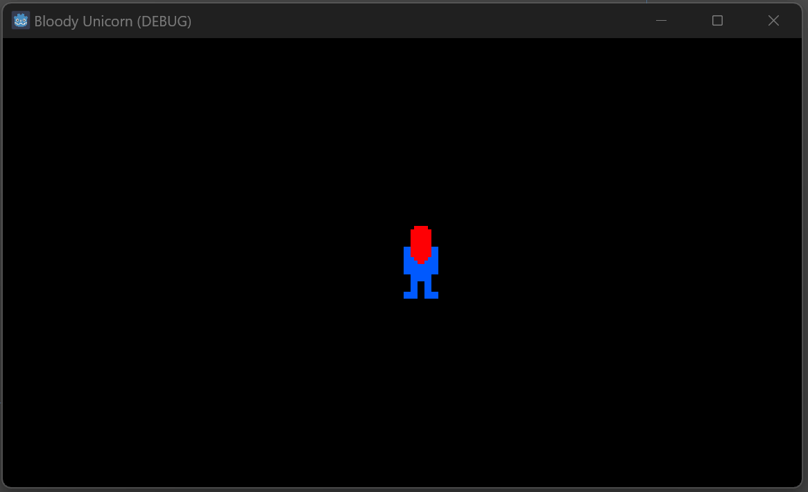
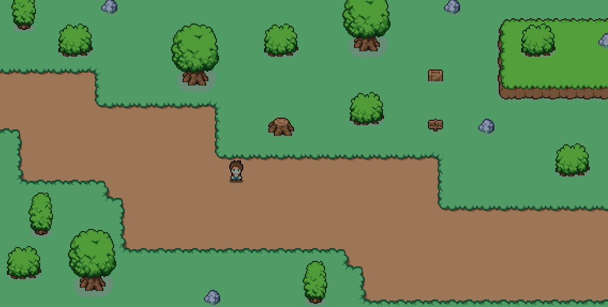
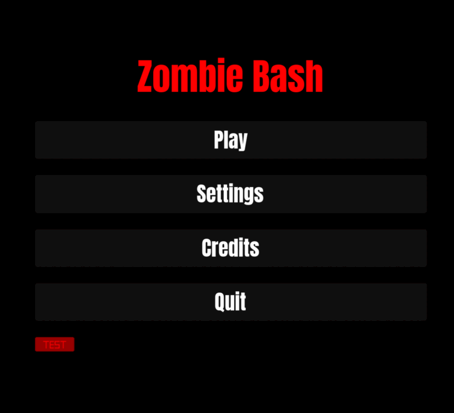
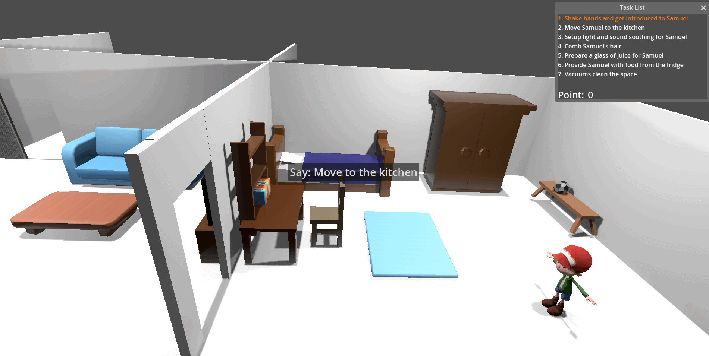
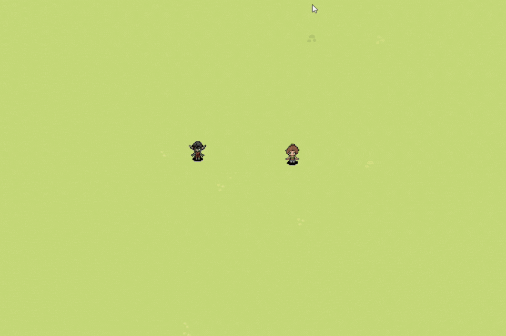
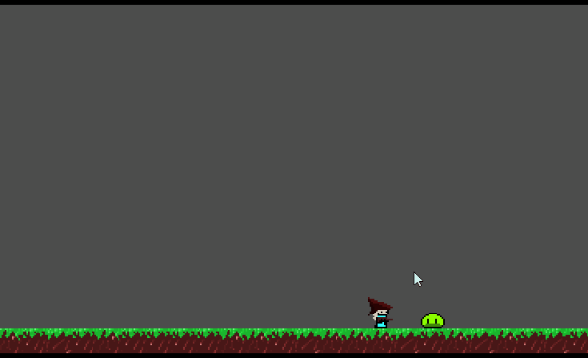

# 2024 - Fall

## [Game Portfolio for NMSU Digital Game Design](/../index.md)

Projects are organized by team. Each team has the animated gif of their logo, and a series of games below, each with a gif preview and links to versions of the game.

## Contents

- [Anointed](#anointed---dominik-trujillo-dtru5)
- [Bingo](#Bingo---FuadAhmad-shafiqaust)
- [Bloody Unicorn](#bloody-unicorn---karina-gonzaleskbg2201-david-davidkuntz02-ryan-rweems3-avery-gremloid)
- [BOOM!](#boom---christopher-biekeu-indronil-bhattacharjee-mingfang-zhu-redwan-ul-haq-choyon-sarhan-osman-bhuiya)
- [CodeCrashers](#Team-CodeCrashers----Akanksha4varma-Jaya-Jwalitha-Nagulla-meghana-20-Rama-Chandra-Baddireddy)
- [GAME CHANGERS](#GAME-CHANGERS---Fayaz-Shaik-Jyothiswaroop-Koyya-Mahesh-Maddineni-Vivekananda-Reddy-Pyda-Vivek-Reddy-Suram)
- [Neon Dream-On Joyride !!MISSING!!](#)
- [Roomate Studios](#Roomate-Studios---Matthew-Melendez-Rogelio-Long)
- [Rust Rescue !!MISSING!!](#)
- [Space Marshall](#Space-Marshall---chiagozie-Emelife-Julio-Estrada-Kwabena-Adu-Agyemang-Mauricio-Munoz-Sayantan-Maity)
- [*Totally NOT Adderall Abusers*](#totally-not-adderall-abusers---alex-paque-garns-jd-lepinski-matthew-quinones)
- [Wake Up !!MISSING!!](#)
- [Wandering Inn: The Game](#wandering-inn-the-game---alayna-randallmontoya)
- [Zombie Bash](#zombie-bash---arentschool-gturner9371213-hakka2424-robrob7)

- [TA's Example](#Team-TA---Theo-Platt)

### Team CodeCrashers -  Akanksha4varma, Jaya Jwalitha Nagulla, meghana-20, Rama Chandra Baddireddy
[School for Good and Evil](https://meghana-20.github.io/CodeCrashers/)

[v0.1](https://github.com/meghana-20/CodeCrashers/releases/tag/v0.1)

### GAME CHANGERS - Fayaz Shaik, Jyothiswaroop Koyya, Mahesh Maddineni, Vivekananda Reddy Pyda, Vivek Reddy Suram
[Uphill Adventure](https://vivekpyda.github.io/)

[v0.2](https://github.com/Mahesh1998/uphilladventure/releases/tag/v0.2)

### *Totally NOT Adderall Abusers* - [Alex Paque Garns, JD Lepinski, Matthew Quinones]

### Bloody Unicorn - Karina Gonzales(kbg2201), David (Davidkuntz02), Ryan (rweems3), Avery (gremloid)

[Bloody Unicorn Demo](https://kbg2201.github.io/BUD-Team/demo/)

[v0.1](https://github.com/kbg2201/BUD-Team/releases/tag/v0.1)

### Roomate Studios - Matthew Melendez, Rogelio Long

[Escape Velocity](https://requestforcriticism.com/escape-velocity/)

[v0.1](https://github.com/requestforcriticism/escape-velocity/releases/tag/v0.1)

### Space Marshall - chiagozie Emelife, Julio Estrada, Kwabena Adu Agyemang, Mauricio Munoz, Sayantan Maity
[Space Marshall](https://github.com/MoriMnz/spacemarshall/tree/main/webgame)

[v0.1](https://github.com/MoriMnz/spacemarshall/releases/tag/v0.1)

### Zombie Bash - [arentschool, gturner9371213, Hakka2424, RobRob7]
[Zombie Bash](https://robrob7.github.io/Team-Zombie-Bash/WebGame/index.html)

[v0.1](https://github.com/RobRob7/Team-Zombie-Bash/releases/tag/v0.1)

### Bingo - FuadAhmad, shafiqaust

### BOOM! - Christopher Biekeu, Indronil Bhattacharjee, Mingfang Zhu, Redwan Ul Haq Choyon, Sarhan Osman Bhuiya
[BOOM!] We cannot host the game in github.io site because of the .pck file being larger than 100MB github limit. We will show the game functioning in the class.

[v0.1](https://github.com/Indronil-Prince/BOOM-Digital-Game-Design-Project/releases/tag/v1.0)

### Wandering Inn: The Game - Alayna Randall/Montoya
[Wandering Inn](https://alaynar.github.io/wanderingInnGame/wig/index.html)

[v0.1](https://github.com/alaynar/wanderingInnGame/releases/tag/v0.1)

### Anointed - Dominik Trujillo (dtru5)
[Anointed](https://dtru5.github.io/anointedv0.1/)

[v0.1](https://github.com/dtru5/cs477-project_game/releases/tag/v0.1)

" alt="Movement and scene changing" height="128"/>

### Team TA - Theo Platt
[Shotgun Witch](./TAs_example/FPv1/shotgun_witch_FP1.html) 

[v0.1](https://github.com/Theo-Platt/Shotgun_Witch/releases/tag/v0.0.1) 

[v0.2](https://github.com/Theo-Platt/Shotgun_Witch/releases/tag/v0.0.2)

### Rust-Rescue - [ahmedbony, xindi-z]

[Rust-Rescue](https://xindi-z.github.io/Rust-Rescue/index.html)

[v0.1](https://github.com/xindi-z/Rust-Rescue/releases/tag/v0.1)

" alt="demo" height="128"/>
" alt="demo" height="128"/>
