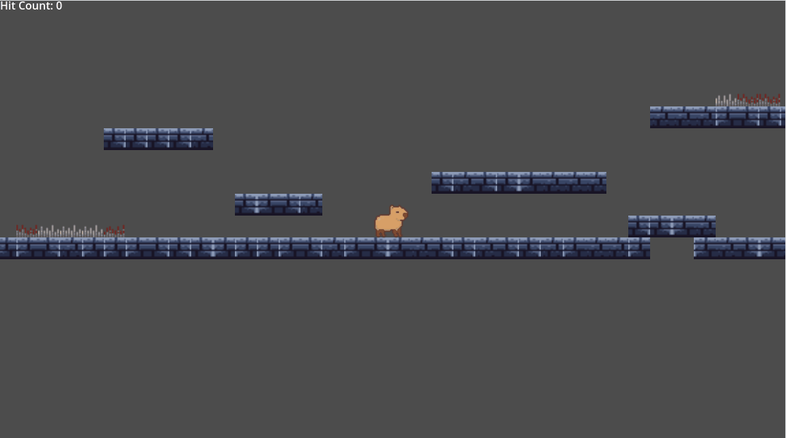
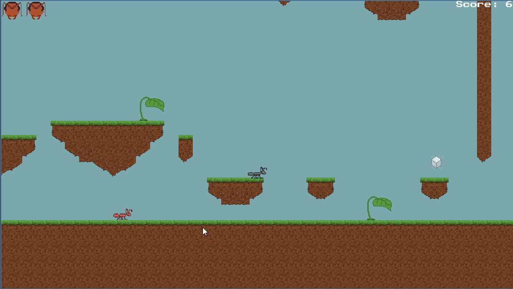
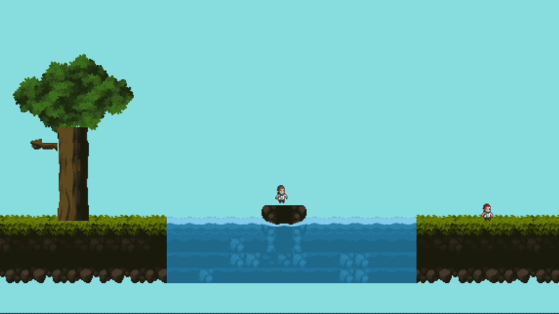
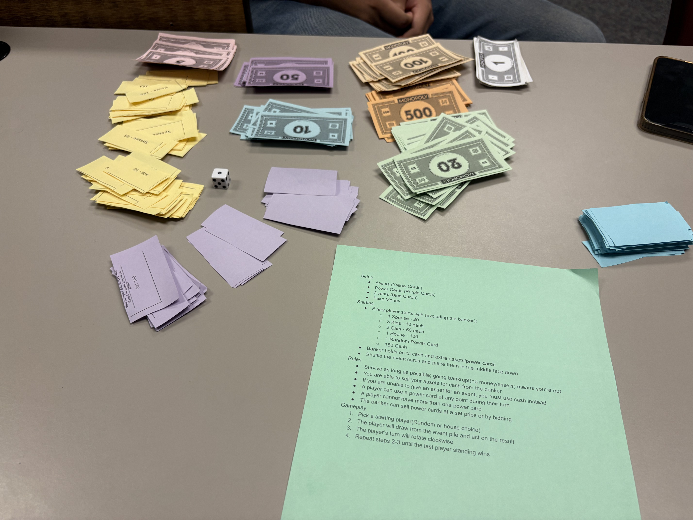

# 2025 - Fall

## Game Portfolio for [NMSU Digital Game Design](/../index.md)

Projects are organized by Game Jams. For each Jam, each team should have a gif preview of their games, which links to live versions of the game hosted on their own github page.

## Contents

#### [Lost in the Sauce](<https://nmsu-digital-game-design.github.io/game-jam-1-game-lost-in-the-sauce/ >)
  
Carson, Diego, Emma, Elias, Renee C, Uziah   
[Lost In The Sauce v1.0](https://nmsu-digital-game-design.github.io/game-jam-1-game-lost-in-the-sauce/)

### [Escalator the Capybara (In-Class Game)](https://bilhamil.github.io/Escalator/)
  
All of Us  
[Release v1.0](https://github.com/bilhamil/Escalator-Demo-Game/releases/tag/v1.0)

### Game Jam 1 (Platformer) Games

#### [Arena Boss Rush](https://wenyangnmsu.github.io/Boss_fight_Game_Jam_1/)
  
Wen Yang, Aniswar Asokkumar, Nana Affram  
[Release v0.0](https://github.com/NMSU-Digital-Game-Design/game-jam-1-game-dodge-dash-games/tree/main/arena-boss-clash)

#### [Mindhunter](<https://STeel-5255.github.io/Mindhunter/>)
  
Si, Datta, Manusha, Tajwarh, Isaiah   
[Mindhunter v1.0](https://github.com/NMSU-Digital-Game-Design/game-jam-1-game-sandman-productions/releases/tag/Assets)

#### [AntVenture](https://nmsu-digital-game-design.github.io/game-jam-1-game-antteam/AntVenture/ANTventureLost%20in%20the%20Colony.html)
  
< List of team members >  
Naziya, Victoria, Renae  
[Release v1.0](https://nmsu-digital-game-design.github.io/game-jam-1-game-antteam/AntVenture/ANTventureLost%20in%20the%20Colony.html)

### Game Jam 2 (Multiplayer) Games
### [Room Rush](https://wenyangnmsu.github.io/RoomrushPublish/)
  
Wen Yang  
Diego Lara  
Tajwar-Ul Hoque  
Naziya Begum  
[Release v1.0] (https://github.com/NMSU-Digital-Game-Design/game-jam-2-roomrush/releases/tag/Release)

#### [Cash Crew](https://datta2907.github.io/cash-crew/)
 
Srinivas Madireddy, Manusha Vemulapalli, Michael Gremse  
[Release v1.0](https://github.com/Datta2907/cash-crew/releases/tag/cash-crew-release)

#### [Midnight Munchies](https://ca55706.github.io/midnightmuchies/)
 
Victoria Trevino, Nana Affram, Uziah Wilson  
[Release v1.1](https://github.com/NMSU-Digital-Game-Design/game-jam-2-midnight-munchies/releases/tag/v1.1)

### [PostPals](https://carsonsiegrist.github.io/gj2-post-pals/)
 
Renee Catanach  
Carson Siegrist  
Isaiah  
Aniswar  
[Release v1.0](https://github.com/NMSU-Digital-Game-Design/game-jam-2-postpals/releases/tag/Release)

#### [The Coco-nut Crisis](<https://steel-5255.github.io/The_Coconut_Crisis/>)
  
Renae H, Emma J, Si T, Elias R   
[The Coco-nut Crisis v1.0](https://github.com/NMSU-Digital-Game-Design/game-jam-2-the-coconuts/releases/tag/Release)

### Game Jam 3 (Board) Games

#### [Scapegoat](<https://github.com/NMSU-Digital-Game-Design/game-jam-3-scapegoats/releases/tag/BoardGame2>)
  
Nana, Uziah, Si, Naziya, Tajwar

### Game Jam 4 Games

#### [Desert Swarm](https://steel-5255.github.io/DesertSwarm/)
  
Si, Datta, Manusha, Tajwarh, Isaiah, Aniswar   
[Release v1.0](https://github.com/NMSU-Digital-Game-Design/game-jam-4-swarmingsandman/releases/tag/Release)
