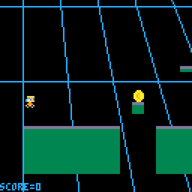

# Game Portfolio for NMSU Digital Game Design

This page provides portfolio pages for projects developed in Prof. [Z Toups Dugas'](https://pixl.nmsu.edu/people/z) NMSU Digital Game Design course (C S 477 / 517). 

Information on how the site is structured, mostly for students working on it, can be found on the [instructions page](instructions.md). 

Years for which we have projects are listed below:

* [2020 - Fall](/2020-3/index.md)

[Ninja Runner](ninjarunner.html) \| [v1.0](https://github.com/ecdraayer/TheConeGameProject/releases/tag/v1.0)

